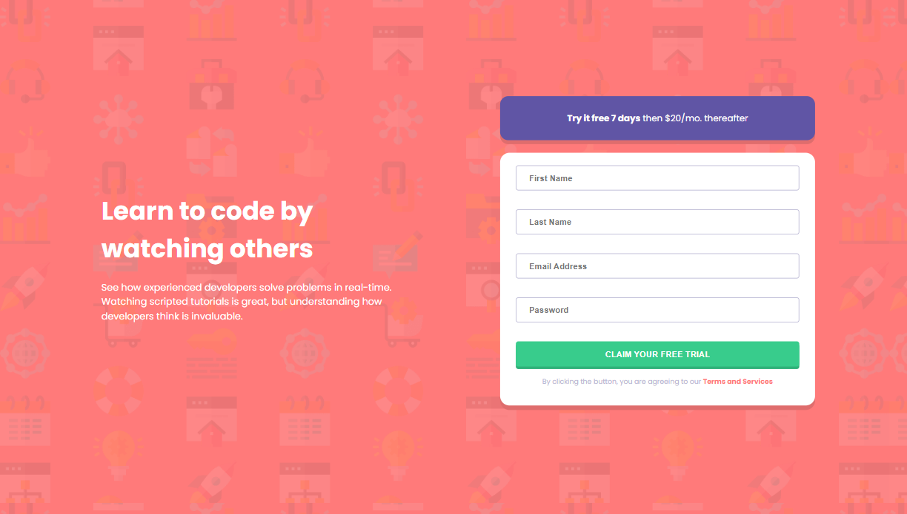
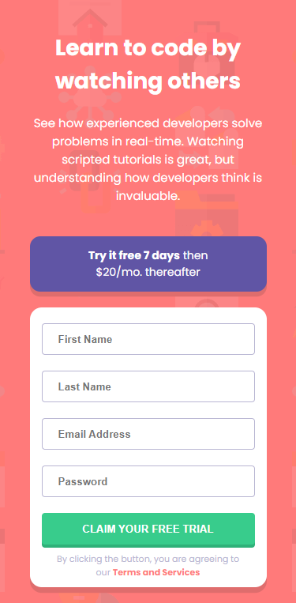

# Intro Component with Signup Form

This is a solution to the Intro Component with Signup Form challenge from Frontend Mentor, built using ReactJS and the `useForm` hook from the `react-hook-form` library.

## Overview

The Intro Component with Signup Form challenge requires building a responsive sign-up form that includes validation and error messages. The form should have four input fields: the user's first and last name, email, and password. The validation requirements are as follows:

- Email should be a valid email address
- Password should be at least 8 characters

The form is built using the `useForm` hook from the `react-hook-form` library. This allows for easy form management, validation, and error handling.

If any of the validation requirements are not met, the form should display an error message.

## Screenshot

|  |  |
| ------------------------------ | ----------------------------- |
| Desktop version                | Mobile version                |

## Links

- [View the live site](https://hatemhenchir.github.io/intro-component-with-signup-form/)
- [View the Frontend Mentor challenge](https://www.frontendmentor.io/challenges/intro-component-with-signup-form-5cf91bd49edda32581d28fd1)

## Features

- Responsive design for different screen sizes
- Validation and error messages for form input fields

## Technologies

- ReactJS
- HTML5
- CSS3
- `react-hook-form`

## Setup

To install and run the project, follow these steps:

1. Clone the repository: `git clone https://github.com/hatemhenchir/intro-component-with-signup-form.git`
2. Navigate to the project directory: `cd intro-component-with-signup-form`
3. Install the dependencies: `npm install`
4. Start the development server: `npm start`

The project should now be running on `http://localhost:3000`.

## Usage

To use the project, open a web browser and navigate to the live demo URL.

Enter your first name, last name, email, and password in the form fields. If any of the validation requirements are not met, an error message will be displayed.

## Acknowledgements

Thank you to Frontend Mentor for providing the challenge and to the React community for creating such a powerful framework.

## Credits

Design inspiration and assets provided by [Frontend Mentor](https://www.frontendmentor.io/)
- My LinkedIn: [@hatem-henchir-7a92141a8](https://www.linkedin.com/in/hatem-henchir-7a92141a8/)
- My Frontend Mentor: [@hatemhenchir](https://www.frontendmentor.io/profile/hatemhenchir)
